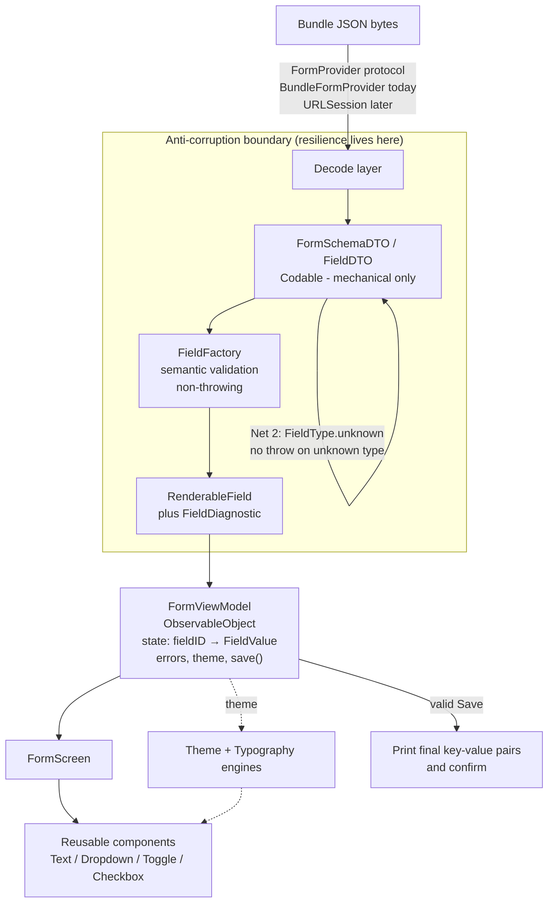

# Eulerity — Server-Driven UI Form Engine

A server-driven form engine for iOS. The backend ships a JSON payload that fully
describes a form — fields, order, theme, validation — and the app renders it
dynamically. Today the JSON is bundled locally, but it's built as if it came from a
server that can send anything: unknown field types, missing arrays, contradictory
constraints, bad hex. The engine degrades gracefully — it drops the bad field and keeps
rendering the rest, and never crashes.

- **Swift + SwiftUI**, single screen, **iOS 16** minimum, fully offline.
- **Strict MVVM**, Dark/Light compliant, HIG-based components.

## How to run

1. Open `Eulerity.xcodeproj` in Xcode.
2. Pick any iOS Simulator (iOS 16+) and **Run** (`⌘R`).

The form loads from the bundled `form.json` on launch.

### See the resilience for yourself

Tap the **ladybug** menu (top-right) and choose **"Edge cases (hostile)"**. This loads
`form_edgecases.json` — a deliberately broken payload (unknown type, missing/duplicate
id, empty dropdown, bad-typed `order`, `max_length: 0`, unknown subtype, bad theme/link
hex, a non-object array element). The form renders the **6 valid fields** and silently
drops the **5 bad ones**. Switch back to "Standard form" to return to `form.json`.

### Tests

In Xcode: `⌘U`. Or from the command line:

```sh
# use any installed iOS 16+ simulator name (xcrun simctl list devices)
xcodebuild test -project Eulerity.xcodeproj -scheme Eulerity \
  -destination 'platform=iOS Simulator,name=iPhone 16'
```

Current state: **78 unit tests** (parsing, factory mapping, theme resolution,
validation, view-model state/save, rich-text builder, end-to-end resilience) and
**2 UI tests** (empty Save → inline error; valid Save → confirmation), all passing.
The unit/logic suite was written before any UI existed.

> Note: if `xcodebuild` reports it needs Xcode but finds only Command Line Tools,
> prefix with `DEVELOPER_DIR=/Applications/Xcode.app/Contents/Developer` (or run
> `sudo xcode-select -s /Applications/Xcode.app`).

## Approach & architecture



The core idea is a **two-net decoding firewall**. The DTO layer is permissive and
**never throws on unexpected data**: each array element decodes through a failable
wrapper (a bad element becomes `nil` and is dropped, its neighbours survive), and
unknown `type`/`subtype` values decode into an `.unknown` case instead of failing.
`FieldFactory` is then the single place that decides what is actually renderable —
non-throwing, it drops or degrades fields and records a diagnostic for each decision.
The result is that the View only ever sees a trusted `[RenderableField]` and contains
**zero defensive code**.

Everything is strict **MVVM**: a `FormViewModel` (`@MainActor`, `ObservableObject` — no
Observation framework, for iOS 16) is the single source of truth for state, validation
and Save. The decode → map → validate core is headless and was unit-tested before any UI
was written. Theme (server hex → `RGBAColor`, headless) and the font engine
(`Typography`, one file) feed a `FormPalette` distributed via the environment.

Full module map and the data-flow notes are in [ARCHITECTURE.md](ARCHITECTURE.md);
the milestone log is in [PROGRESS.md](PROGRESS.md).

## Product & edge-case decisions

The brief's examples (missing data, contradictory constraints, validation timing) all
have edges it left undefined. The three that mattered most:

**1. Render order when `order` is duplicated or missing.** *Undefined:* the brief says
sort by `order`, never array index — but `order` is server-supplied, so values can tie
or be absent, and Swift's `sort` isn't stable. *Decided:* capture each field's source
position and sort by the tuple `(order ?? .max, sourceIndex)`. *Why:* `sourceIndex` is
unique, so it's a total order — deterministic on every run, ties break by payload order,
missing `order` sinks to the bottom without dropping the field.

**2. Duplicate or missing `id`: first-wins, drop the rest.** *Undefined:* what to do when
`id` collides or is absent. *Decided:* a field with no usable `id` is dropped; a
duplicate keeps the first occurrence and drops the later one (with a diagnostic). *Why:*
`id` is the state-dictionary key, the Save-payload key, and the `ForEach` identity — a
collision corrupts all three, so unlike `order` or `max_length` it can't be degraded, it
has to be the one hard requirement.

**3. Validation timing and `max_length`.** *Undefined:* when errors appear and what
`max_length` enforces. *Decided:* errors surface **on Save** (and clear as you edit the
field); character counters are **live**; `max_length` is a **hard typing limit**
(truncation at input), not a Save-time error. *Why:* it matches the brief's "errors on
Save, counters live" and makes `max_length` impossible to violate — so it's never a
failure case the user can hit.

The complete decision log (D1–D23) with context, alternatives and why each was rejected
is in [DECISIONS.md](DECISIONS.md).

## What I'd improve with more time

- **Networked provider.** The `FormProvider` protocol is already the swap point; a
  `URLSession`-backed provider (re-introducing `async` at that boundary only) would move
  the form to a real server with the parse → map → validate pipeline untouched.
- **Richer metadata links.** Rich-text checkbox labels currently link the *first*
  occurrence of each metadata key. All-occurrences and an explicitly ordered metadata
  contract would be a natural extension.
- **Broader UI test coverage.** Two XCUITests cover the Save flow; the multi-select sheet
  and the link-tap → Safari hop are currently covered by unit tests + the standard
  mechanism rather than scripted UI taps.
- **Housekeeping.** The default Xcode UI-test template still sits alongside the real UI
  tests and could be pruned; dropped-field diagnostics are `debugPrint`-only and could
  optionally surface in a debug overlay.

## What I got stuck on & how I worked through it

**The isolation deadlock.** I'd speculatively made the bundle loader `async` for a future
network swap. It bought nothing today (the bundle read is synchronous) and collided with
the project's `NonisolatedNonsendingByDefault` concurrency feature: awaiting that
nonisolated `async` function from an `@MainActor` XCTest hung two test cases (~10s, then
killed). I de-risked it first — a throwaway smoke screen proved the *runtime* `load()`
path was fine in the simulator, so it was an XCTest-runner interaction, not a product
bug — and then fixed it properly by **removing the premature `async`**: the protocol is
still the swap point, the two tests went green and unskipped. The lesson is in the commit
trail and [DECISIONS.md](DECISIONS.md) (D5/D8/D14).

**A smaller one:** with `MEMBER_IMPORT_VISIBILITY` enabled, `@Published` failed to compile
until I imported `Combine` explicitly — SwiftUI's transitive re-export isn't visible under
that setting.

A fuller narrative of the AI-assisted workflow is in
[AI_COLLABORATION_LOG.md](AI_COLLABORATION_LOG.md).
